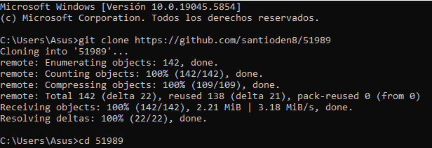
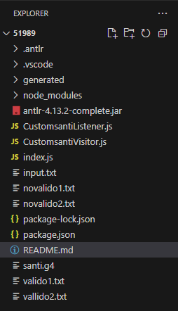
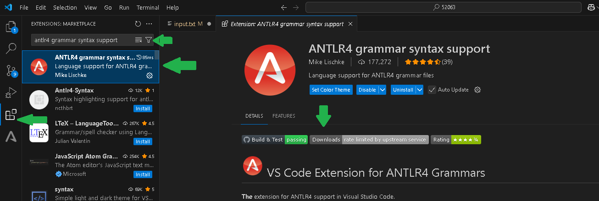
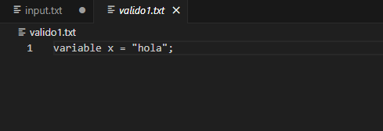
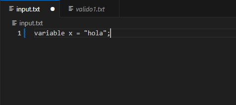
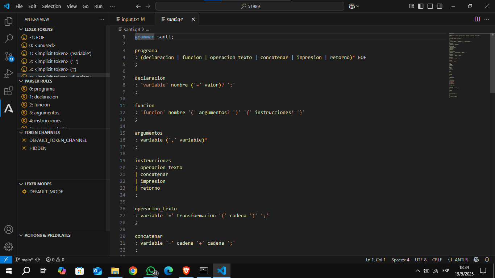
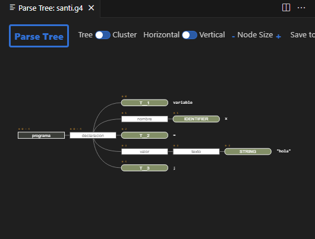
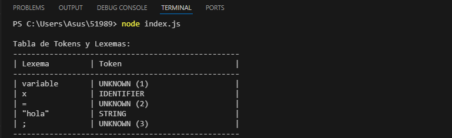
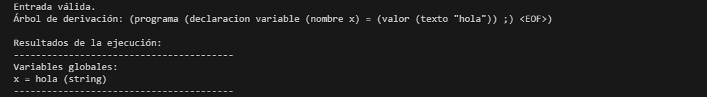

Hola!
En este repositorio tenemos los archivos para poder ejecutar y utilizar el analizador que me toco hacer para la catedra de Sintaxis y Semantica de lenguajes, 
⚠️Antes de empezar⚠️:
los requisitos previos son, en una pc tener instalado: VS code, JDK 17 o superior, Node.js v16 o superior y npm(incluido con node)

A) CLONAR PROYECTO

Empezamos con los pasos para clonar los archivos y poder usarlos en tu VS code:

1.Abrimos un cmd o powershell

2.Clonamos el git con el comando: git clone https://github.com/santioden8/51989

3.Elegimos la carpeta 51989 con el comando: cd 51989

Luego de esto deberia abrirse el VS code y deberiamos ver los archivos:

B) DENTRO DE VS CODE

Instalaremos o verificaremos que tenemos la extensión de ANTLR4:

C) ARCHIVOS A TENER EN CUENTA:

-TestSuite.g4 (la gramÁtica)

-Input.txt (lo que entra a nuestro analizador)

-Los 4 archivos nombrados valido ó no valido
Los archivos válidos son aquellos que mostrarán el correcto resultado de nuestro código, mientras que los no válidos, son aquellos que nos servirán para ver los posibles errores de nuestro código.

D) FUNCIONAMIENTO DEL PROGRAMA:

Para analizar el funcionamiento del programa, debemos copiar lo que tenemos en valido1.txt (o en novalido1) y pegarlo en input.txt

    

Luego, nos dirigimos al archivo santi.g4, donde se encunetra nuestra gramática y tocamos el pluggin de ANTlR4 para ver los tokens, parser rules de nuestra gramatica:

Si tocamos F5, podremos ver el árbol de derivación 🌳:

E) MODO DE USO - TABLA DE LEXEMAS:

Iniciamos un terminal y colocamos el comando node index.js, donde veremos si la entrada es válida.

En caso de ser válida, nos mostrará la tabla de lexemas y tokens y el intérprete.

En caso de no ser válida, nos mostrará el error

D) TRADUCCIÓN A JAVASCRIPT

//Podrán probar cualquiera de los archivos .txt y ver cada uno de los detalles que aclare en los incisos anteriores!
